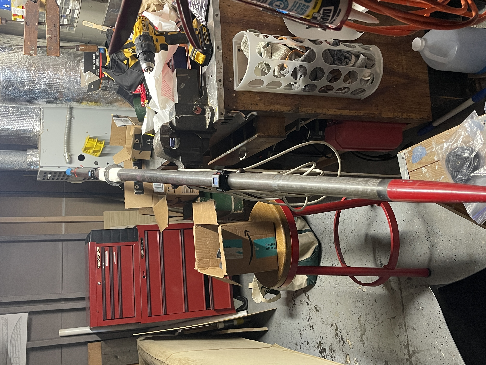
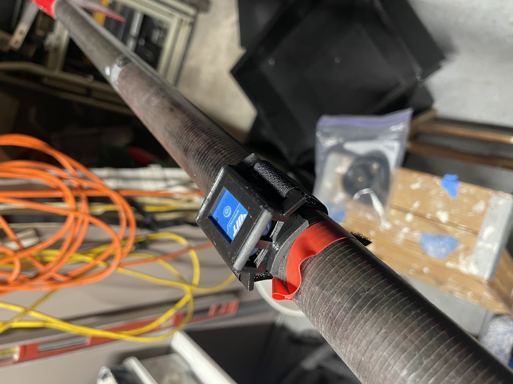
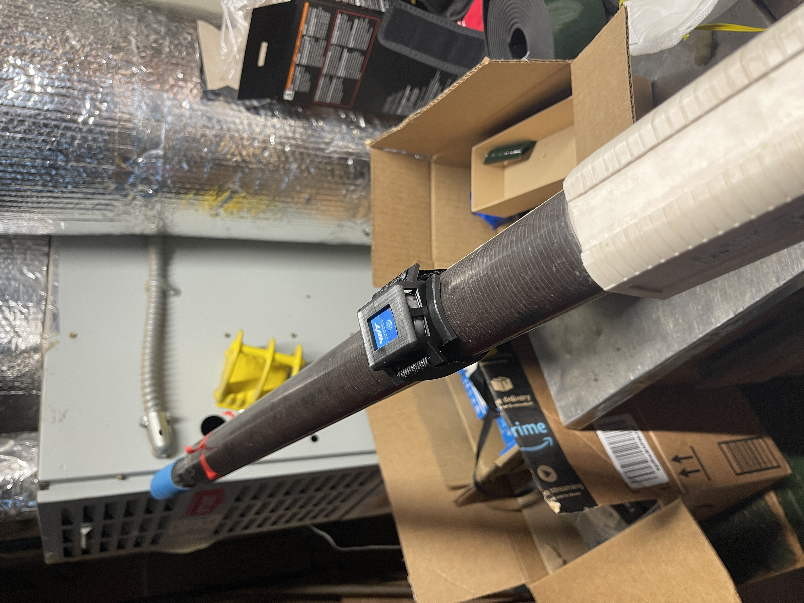

```{r setup, include=FALSE}
knitr::opts_chunk$set(echo = FALSE, fig.align = "center", out.width = "70%")
```

## Required Components (Per Sensor)

1. Bluetooth motion sensor  
2. Silicone rubber wedding band  
3. Plastic mount bracket  
4. Neoprene rubber pad  
5. Velcro strap  

---

## Assembly Instructions

The silicone wedding band seals the sensor from water at the USB-C port and seam. Invert it so the **flat smooth side contacts the sensor**. Wrap it around the sensor as shown below.

```{r}

```

Insert the sensor (with band) into the plastic mount bracket. Ensure the button faces away from the curved underside. Verify the band hasn’t shifted off the port or seam.

Place the neoprene pad between the bracket and the oar shaft. It adds friction and protects the oar.

Secure the bracket to the oar using the Velcro. Tighten firm enough to prevent slip from a forceful finish feather motion.

```{r}

```

The bracket curvature is sized to fit all oars with the extremes being standard sweeps and skinny shaft sculls.

---

## Sensor Orientation

Correct sensor orientation is important, but not critical due to on-water calibration. The USB-C port (and text “ritmoForceCurve”) need to face the **blade end**.

During the drive, the sensor button should be horizontal; during recovery, vertical. Mount the sensor this way before launch.

```{r}

```

Place one sensor between the handle and the button, and the other about two-thirds between the button and blade. Refer to the image above.

---

## Connecting Sensors

1. Turn on sensors before placing the oar in the oarlock or shoving from dock.  
2. On the app main menu, press **Connect Oar Sensors**.  
3. Select both sensors (MAC addresses will appear), then press **DONE**.  


---

## Oar Sensor Setup

1. After sensors are connected to go Oar Sensor Setup  
2. Choose port or starboard.  
3. To check Sensor alignment, place oar blade face up on level floor with something between the back of the sleeve and the floor that keeps the back of the sleeve parallel to floor. 
4. Check to make sure angles for both sensors are within -5 to 5 deg. Adjust if necessary. The app auto calibrates while you are rowing but needs them to be reasonably close.

---

## Bend Force Calibration

This setting scales **Watts and powerSplit** but doesn’t affect:  
- Max bend  
- Force curve shape  
- Stroke length  
- Catch or Finish miss values.  

Bend varies with sensor distance and oar stiffness. For now, adjust the value until powerSplit looks correct. In future updates, we’ll provide notes on how to calibrate using HR and steady-state watts.

---

## Post-Row Analysis

```{r post_row_html, results='asis', echo=FALSE}
knitr::asis_output('
<iframe
  src="post_row_analysis.html"
  style="width:100%; height:900px; border:0;"
  sandbox="allow-scripts allow-same-origin">
</iframe>')


